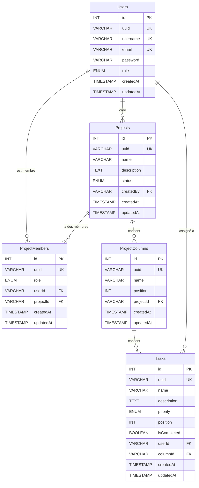

# 🚀 TaskFlow — Server API

> **API REST de gestion de projets et de tâches** construite avec Express, TypeScript et MySQL.
> TaskFlow est un outil de gestion de type Kanban permettant d'organiser des projets en colonnes et tâches, avec authentification JWT.

---

## 📋 Table des matières

- [Technologies](#-technologies)
- [Architecture du projet](#-architecture-du-projet)
- [Prérequis](#-prérequis)
- [Installation](#-installation)
- [Variables d'environnement](#-variables-denvironnement)
- [Scripts disponibles](#-scripts-disponibles)
- [Base de données](#-base-de-données)
- [Routes API](#-routes-api)
- [Authentification](#-authentification)
- [Documentation Swagger](#-documentation-swagger)
- [Tests](#-tests)

---

## 🛠 Technologies

| Technologie         | Rôle                                  |
| ------------------- | ------------------------------------- |
| **Express**         | Framework HTTP                        |
| **TypeScript**      | Typage statique                       |
| **MySQL2**          | Client base de données MySQL          |
| **JWT**             | Authentification par token            |
| **bcryptjs**        | Hashage des mots de passe             |
| **Swagger**         | Documentation interactive de l'API    |
| **Jest / Supertest**| Tests unitaires et d'intégration      |
| **Faker.js**        | Génération de données fictives (seed) |
| **tsx**             | Exécution directe de TypeScript       |
| **cookie-parser**   | Gestion des cookies                   |
| **cors**            | Gestion des requêtes cross-origin     |
| **uuid**            | Génération d'identifiants uniques     |

---

## 📁 Architecture du projet

```
server/
├── bin/
│   ├── migrate.ts          # Script de migration de la BDD
│   └── seed.ts             # Script de seeding (données fictives)
├── database/
│   ├── client.ts           # Client de connexion MySQL
│   ├── checkConnection.ts  # Vérification de la connexion à la BDD
│   ├── schema.sql          # Schéma SQL de la base de données
│   └── fixtures/           # Seeders pour alimenter la BDD
│       ├── AbstractSeeder.ts
│       ├── UserSeeder.ts
│       └── ItemSeeder.ts
├── src/
│   ├── main.ts             # Point d'entrée du serveur
│   ├── app.ts              # Configuration Express (middlewares, routes)
│   ├── swagger.ts          # Configuration Swagger
│   ├── dto/                # Data Transfer Objects (validation des données)
│   │   ├── UserDTO.ts
│   │   ├── ProjectDTO.ts
│   │   ├── ColumnDTO.ts
│   │   └── TaskDTO.ts
│   ├── interfaces/         # Interfaces TypeScript
│   │   ├── IUser.ts
│   │   ├── IProject.ts
│   │   ├── IColumn.ts
│   │   ├── ITask.ts
│   │   └── JwtPayload.ts
│   ├── middlewares/
│   │   └── verifyToken.ts  # Middleware d'authentification JWT
│   ├── modules/            # Logique métier (Controller + Repository)
│   │   ├── auth/
│   │   ├── user/
│   │   ├── project/
│   │   ├── column/
│   │   └── task/
│   ├── routes/             # Définition des routes API
│   │   ├── authRoutes.ts
│   │   ├── userRoutes.ts
│   │   ├── projectRoutes.ts
│   │   ├── columnRoutes.ts
│   │   ├── taskRoutes.ts
│   │   └── health.ts
│   ├── types/
│   └── utils/
│       └── generatePosition.ts
├── tests/                  # Tests automatisés
├── .env.sample             # Exemple de variables d'environnement
├── package.json
├── tsconfig.json
└── jest.config.js
```

L'architecture suit un pattern **MVC** (Model-View-Controller) organisé par **modules** :
- **Routes** → Déclaration des endpoints et liaison aux controllers
- **Controllers** → Traitement des requêtes/réponses HTTP
- **Repositories** → Accès aux données (requêtes SQL)
- **DTOs** → Validation et transformation des données entrantes
- **Interfaces** → Typage strict des entités
- **Middlewares** → Logique transversale (authentification)

---

## ✅ Prérequis

- [Node.js](https://nodejs.org/) (v18+)
- [MySQL](https://www.mysql.com/) (v8+)
- npm

---

## 🚀 Installation

1. **Cloner le dépôt**

   ```bash
   git clone <url-du-repo>
   cd server
   ```

2. **Installer les dépendances**

   ```bash
   npm install
   ```

3. **Configurer les variables d'environnement**

   ```bash
   cp .env.sample .env
   ```

   Puis modifier le fichier `.env` avec vos propres valeurs (voir section suivante).

4. **Créer la base de données et exécuter les migrations**

   ```bash
   npm run db:migrate
   ```

5. **Alimenter la base avec des données fictives (optionnel)**

   ```bash
   npm run db:seed
   ```

6. **Lancer le serveur en mode développement**

   ```bash
   npm run dev
   ```

   Le serveur sera accessible sur `http://localhost:3310` par défaut.

---

## 🔐 Variables d'environnement

Créez un fichier `.env` à la racine du dossier `server/` en vous basant sur `.env.sample` :

```env
# Configuration de l'application
APP_PORT=3310
APP_SECRET=votre_clé_secrète

# Configuration de la base de données
DB_HOST=localhost
DB_PORT=3306
DB_USER=votre_utilisateur
DB_PASSWORD=votre_mot_de_passe
DB_NAME=nom_de_la_base

# URL du client (pour la configuration CORS)
CLIENT_URL=http://localhost:3000
```

| Variable       | Description                               | Valeur par défaut    |
| -------------- | ----------------------------------------- | -------------------- |
| `APP_PORT`     | Port du serveur                           | `3310`               |
| `APP_SECRET`   | Clé secrète pour la signature JWT         | —                    |
| `DB_HOST`      | Hôte de la base de données MySQL          | `localhost`          |
| `DB_PORT`      | Port MySQL                                | `3306`               |
| `DB_USER`      | Utilisateur MySQL                         | —                    |
| `DB_PASSWORD`  | Mot de passe MySQL                        | —                    |
| `DB_NAME`      | Nom de la base de données                 | —                    |
| `CLIENT_URL`   | URL du frontend (CORS)                    | `http://localhost:3000` |

---

## 📜 Scripts disponibles

| Commande             | Description                                                |
| -------------------- | ---------------------------------------------------------- |
| `npm run dev`        | Lance le serveur en mode développement (hot-reload)        |
| `npm start`          | Lance le serveur en mode production                        |
| `npm run db:migrate` | Exécute les migrations SQL (création des tables)           |
| `npm run db:seed`    | Alimente la base avec des données fictives (Faker.js)      |
| `npm run check-types`| Vérifie le typage TypeScript sans compiler                 |
| `npm test`           | Exécute les tests unitaires avec Jest                      |

---

## 🗄 Base de données

Le schéma relationnel est composé de **5 tables** :



### Relations clés

- Un **utilisateur** peut créer plusieurs **projets**
- Un **projet** peut avoir plusieurs **membres** (via `ProjectMembers`)
- Un **projet** contient plusieurs **colonnes** (workflow Kanban)
- Une **colonne** contient plusieurs **tâches**
- Une **tâche** peut être assignée à un **utilisateur**

---

## 🌐 Routes API

Toutes les routes sont préfixées par `/api`.

### 🔑 Auth (`/api/auth`)

| Méthode | Endpoint         | Description                   | Auth requise |
| ------- | ---------------- | ----------------------------- | :----------: |
| `POST`  | `/auth/register` | Inscription d'un utilisateur  |      ❌      |
| `POST`  | `/auth/login`    | Connexion d'un utilisateur    |      ❌      |
| `POST`  | `/auth/logout`   | Déconnexion d'un utilisateur  |      ✅      |

### 👤 Users (`/api/users`)

| Méthode  | Endpoint          | Description                           | Auth requise |
| -------- | ----------------- | ------------------------------------- | :----------: |
| `GET`    | `/users/profile`  | Récupérer le profil connecté          |      ✅      |
| `GET`    | `/users`          | Récupérer tous les utilisateurs       |      ✅      |
| `GET`    | `/users/:uuid`    | Récupérer un utilisateur par UUID     |      ✅      |
| `PUT`    | `/users/:uuid`    | Modifier un utilisateur               |      ✅      |
| `DELETE` | `/users/:uuid`    | Supprimer un utilisateur              |      ✅      |

### 📂 Projects (`/api/projects`)

| Méthode  | Endpoint                | Description                              | Auth requise |
| -------- | ----------------------- | ---------------------------------------- | :----------: |
| `GET`    | `/projects`             | Récupérer tous les projets               |      ✅      |
| `GET`    | `/projects/user/:uuid`  | Récupérer les projets d'un utilisateur   |      ✅      |
| `GET`    | `/projects/:uuid`       | Récupérer un projet par UUID             |      ✅      |
| `POST`   | `/projects`             | Créer un nouveau projet                  |      ✅      |
| `PUT`    | `/projects/:uuid`       | Modifier un projet                       |      ✅      |
| `DELETE` | `/projects/:uuid`       | Supprimer un projet                      |      ✅      |

### 📊 Columns (`/api/columns`)

| Méthode  | Endpoint                          | Description                                | Auth requise |
| -------- | --------------------------------- | ------------------------------------------ | :----------: |
| `GET`    | `/columns/project/:projectUuid`   | Récupérer les colonnes d'un projet         |      ✅      |
| `GET`    | `/columns/:uuid`                  | Récupérer une colonne par UUID             |      ✅      |
| `POST`   | `/columns`                        | Créer une nouvelle colonne                 |      ✅      |
| `PUT`    | `/columns/:uuid`                  | Modifier une colonne                       |      ✅      |
| `DELETE` | `/columns/:uuid`                  | Supprimer une colonne                      |      ✅      |

### ✏️ Tasks (`/api/tasks`)

| Méthode  | Endpoint                     | Description                              | Auth requise |
| -------- | ---------------------------- | ---------------------------------------- | :----------: |
| `GET`    | `/tasks/column/:columnUuid`  | Récupérer les tâches d'une colonne       |      ✅      |
| `POST`   | `/tasks`                     | Créer une nouvelle tâche                 |      ✅      |
| `PUT`    | `/tasks/:uuid`               | Modifier une tâche                       |      ✅      |
| `DELETE` | `/tasks/:uuid`               | Supprimer une tâche                      |      ✅      |

### 💓 Health (`/api`)

| Méthode | Endpoint | Description               | Auth requise |
| ------- | -------- | ------------------------- | :----------: |
| `GET`   | `/`      | Vérification santé du API |      ❌      |

---

## 🔒 Authentification

L'authentification repose sur **JSON Web Tokens (JWT)** :

1. **Inscription** (`POST /api/auth/register`) — Le mot de passe est hashé avec `bcryptjs`
2. **Connexion** (`POST /api/auth/login`) — Un token JWT est généré et renvoyé
3. **Routes protégées** — Le middleware `verifyToken` vérifie le token dans :
   - Le header `Authorization: Bearer <token>`
   - Ou le cookie `access_token`
4. **Déconnexion** (`POST /api/auth/logout`) — Invalidation du token côté client

### Payload du JWT

```typescript
interface JwtPayload {
  userUuid: string;
  email: string;
  username: string;
  role: string;
}
```

---

## 📖 Documentation Swagger

La documentation interactive de l'API est disponible à l'adresse :

```
http://localhost:3310/api-docs
```

Elle est générée automatiquement à partir des annotations JSDoc dans les fichiers de routes.

---

## 🧪 Tests

Les tests sont écrits avec **Jest** et **Supertest** :

```bash
# Lancer tous les tests
npm test
```

La configuration Jest se trouve dans `jest.config.js` et utilise `ts-jest` pour le support TypeScript.

---

## 📝 Exemples de requêtes

### Inscription

```bash
curl -X POST http://localhost:3310/api/auth/register \
  -H "Content-Type: application/json" \
  -d '{
    "email": "user@example.com",
    "username": "monuser",
    "password": "monmotdepasse"
  }'
```

### Connexion

```bash
curl -X POST http://localhost:3310/api/auth/login \
  -H "Content-Type: application/json" \
  -d '{
    "email": "user@example.com",
    "password": "monmotdepasse"
  }'
```

### Créer un projet (authentifié)

```bash
curl -X POST http://localhost:3310/api/projects \
  -H "Content-Type: application/json" \
  -H "Authorization: Bearer <votre_token>" \
  -d '{
    "name": "Mon projet",
    "description": "Description du projet",
    "status": "private"
  }'
```

### Créer une tâche (authentifié)

```bash
curl -X POST http://localhost:3310/api/tasks \
  -H "Content-Type: application/json" \
  -H "Authorization: Bearer <votre_token>" \
  -d '{
    "name": "Ma tâche",
    "description": "Description de la tâche",
    "priority": "high",
    "columnUuid": "<uuid_de_la_colonne>"
  }'
```

---

## 👨‍💻 Auteur

Projet réalisé dans le cadre de la **formation CDA** (Concepteur Développeur d'Applications).
